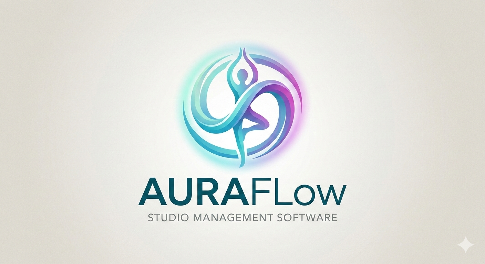

<p align="center">
  
</p>

<p align="center">
  <b>The open-source, AI-powered alternative to MindBody.</b><br>
  An AI backend that monitors membership &amp; churn and helps grow your studio —
  scheduling, memberships, payments, POS &amp; inventory, accounting/tax, video,
  a voice-AI core, marketing &amp; ads, connectors, and a hash-chained audit log.
</p>

<p align="center">
  <a href="LICENSE"></a>
  
  
  <a href="https://auraflow.fit"></a>
</p>

---

AuraFlow is an open, self-hostable studio/wellness management platform — an AI backend
that monitors membership & churn and helps grow your business: scheduling, memberships,
billing, POS & inventory, accounting/tax, an AI/voice core, marketing & ads, connectors,
and a hash-chained audit log.

**License:** [AGPLv3](LICENSE). Free to self-host (single tenant). Multi-tenant
hosting, managed cloud, managed AI, and enterprise features are commercial — see
[`open-core.md`](open-core.md). **Managed cloud:** [auraflow.fit](https://auraflow.fit).

## What's here (free, AGPLv3)

- Dynamic-DB engine + schema provisioning, single-tenant isolation
- Scheduling, memberships, bookings, waivers
- **Retail POS + inventory** — sell product, track stock
- **Accounting & tax** — per-tenant books: bank auto-import, AuraFlow income sync,
  processor fees, reconciliation, P&L / Schedule C / K-1, TurboTax `.txf` + PDF export
- **AI growth engine** — churn / at-risk monitoring, member insights, smart scheduling,
  marketing & ads automation
- AI + voice core — **bring your own API key**
- Base UI + component system, connector framework + build-your-own connectors
- Basic OIDC SSO, hash-chained audit log
- Billing: use your **own** Square/Stripe directly (no platform fee), or opt into
  **managed billing** (`AURAFLOW_BILLING_MODE`) for a turnkey Square setup

## What's NOT here (commercial)

The multi-tenant platform control plane (managing other orgs, platform billing,
sales/marketing automation), managed cloud/AI, enterprise identity (SAML/SCIM),
premium enterprise connectors, and white-label. See [`open-core.md`](open-core.md).

## Quick start

```bash
cp .env.example .env                          # then edit .env — generate strong secrets (see the comments in the file)
docker compose up -d --build                  # Postgres runs init.sql, which builds the schema + a demo tenant
docker compose exec api alembic stamp head    # mark that schema as current (init.sql IS the baseline)
```

Open http://localhost:3000. The demo studio is `demo` (schema `af_tenant_demo`).

> **First install uses `alembic stamp head`, not `upgrade head`** — `init.sql`
> builds the full baseline schema, so you only need to *mark* it current. After
> that, future schema changes ship as Alembic migrations you apply the normal way:
> `docker compose exec api alembic upgrade head`.

## Contributing

Read [`CONTRIBUTING.md`](CONTRIBUTING.md) and sign the [`CLA`](CLA.md). Never commit
secrets or customer data. Security reports: [`SECURITY.md`](SECURITY.md).
